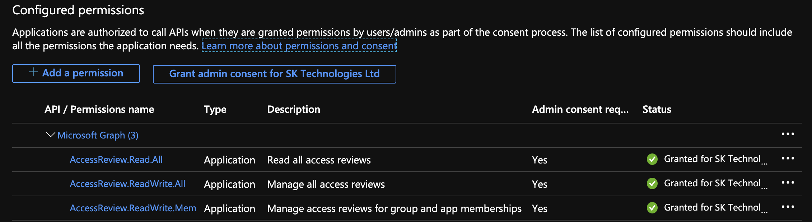
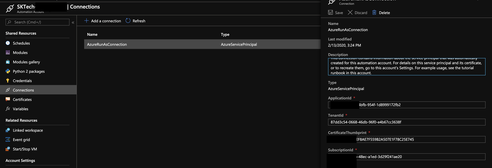
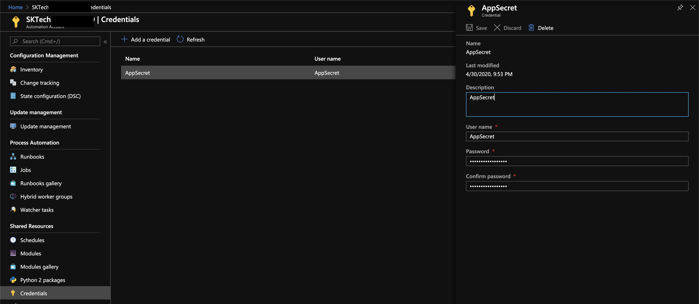
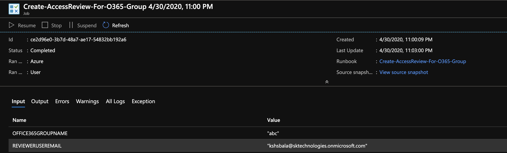
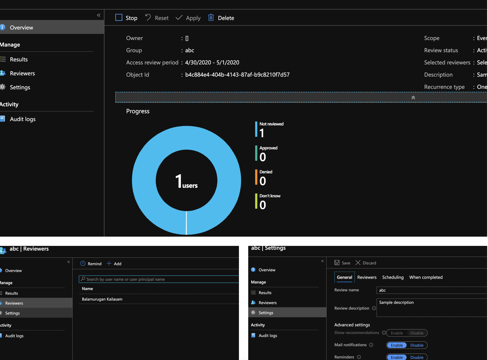
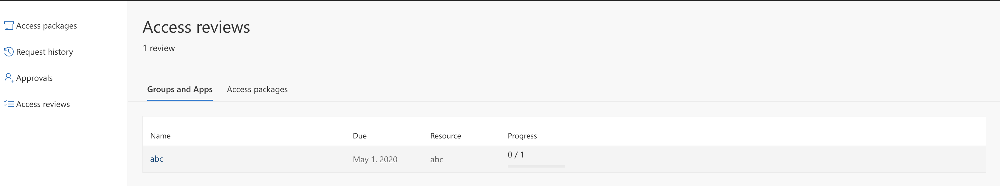

Office 365 groups underpins some of the M365 services and it is always recommended to have a governance in place for a beter management. In some of the large enterprise companies, governance of O365 groups has to be in place to make sure that the right users are in the group. This can be acheived either by using a custom application, third party tools or using the Azure Identity governance.

Here we will see, how we used the Azure Automation to setup an access review of an O365 groups wither when a new groups are created or for an existing group.

#### Azure Application
Register an application with an access to the graph accessReview api as below.

#### Azure Automation

Provision an Azure Automation accounts with the RunAs accounts using the above registered service principal

#### Setup the Application secret as a credentials

Include the above registered application secret as a credentials as below. This will be used within the runbooks at the time of creating an access review.

#### Create a PowerShell based runbook 

Provision a runbook in the Azure Automation account as defined below.

The above runbook performs the following

a. Connects to the AzureAD using the ServicePrincipal.

b. Gets the O365 group details from the AzureAD.

c. Gets the access token for the graph resource.

d. Get the reviewer details.

d. Post a request to https://graph.microsoft.com/beta/accessReviews.

#### Identity Governance - Access Review 

The above runbook creates the access review as below, so that the reviewer can take an appropriate action.

#### Review the access for the O365 group

The reviewer can look into the list of access reviews assigned by visiting the url: https://account.activedirectory.windowsazure.com/r#/accessreviews or this can be accessed from the https://myapps.microsoft.com.

#### Important Notes:

1. The Azure automation uses the beta version of the graph api.

2. Azure Identity governance requires Azure P2 Premium license.