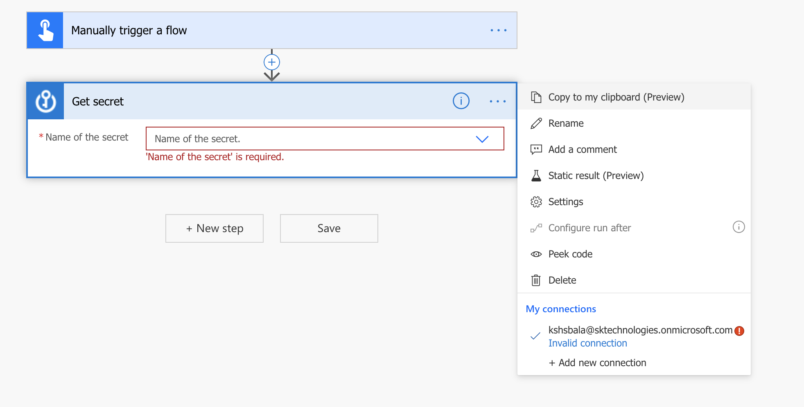

Currently, When we try to connect to the Azure KeyVault in a flow, the connection is not established properly and ended up in invalid connections with a blank KeyVault name as below and this was first reported <a href="https://powerusers.microsoft.com/t5/Connecting-To-Data/Azure-Key-Vault-Connection-Get-Secret-action/m-p/545066?fbclid=IwAR0powDBwi74eAGkc6ZX2JAftGYGtxHmD60W8w7OZrYucZhjkv68H-6yBX4#M8606">here.</a>

Until this is fixed, it can be solved by fixing the actual connection.

#### Check the Connection
If we look into the connection, it displays the Azure KeyVault connection with the "parameter missing" message.

#### Fix the Connection
The above can be fixed, by editing the connection and updating it with the actual KeyVault name to be connected.

After updating the connection with the KV name, the connection needs to be authenticated.

#### Authenticate the Connection
Once the KeyVault name is updated, authenticate the connection again and make sure that the status is set as connected.

#### Create the PowerAutomate / Flow again with the above connection
Once the connection to the KeyVault is fixed by performing the above steps, the KeyVault can be accessed without any issue.

1. Create the Flow to read a KeyVault

#### Execute the Flow
Once the connection is fixed and should be able to execute the flow to connect and retrive the data from the KeyVault.

