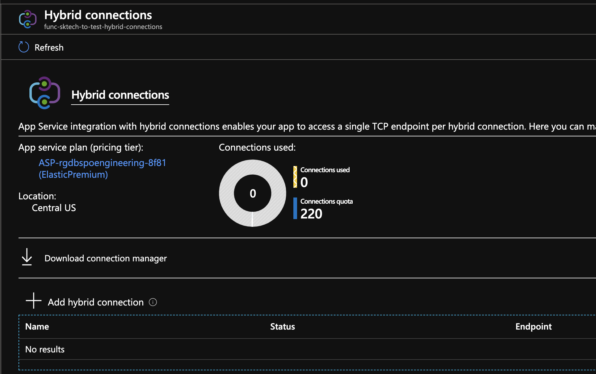
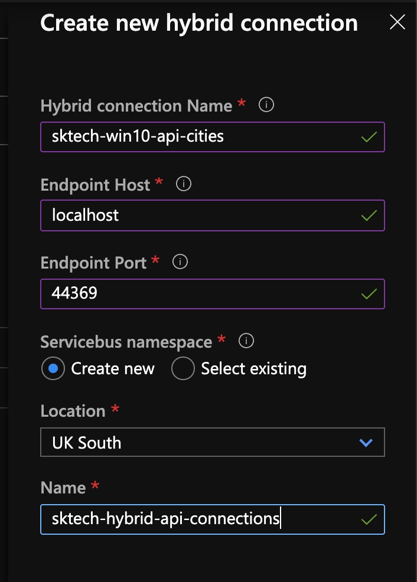
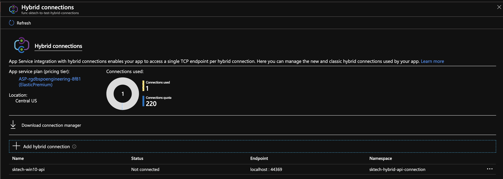
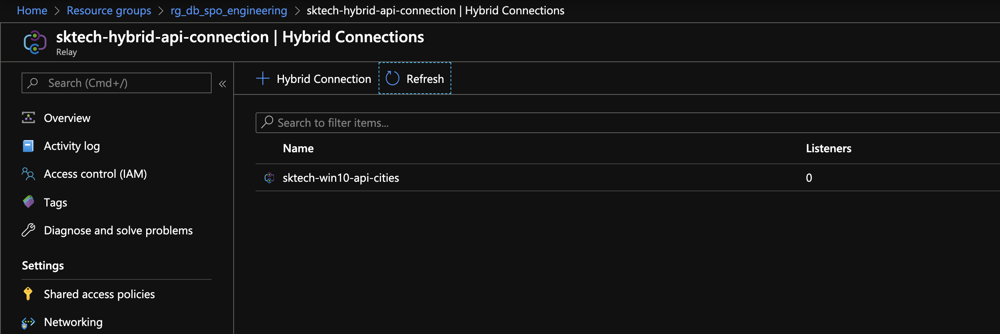
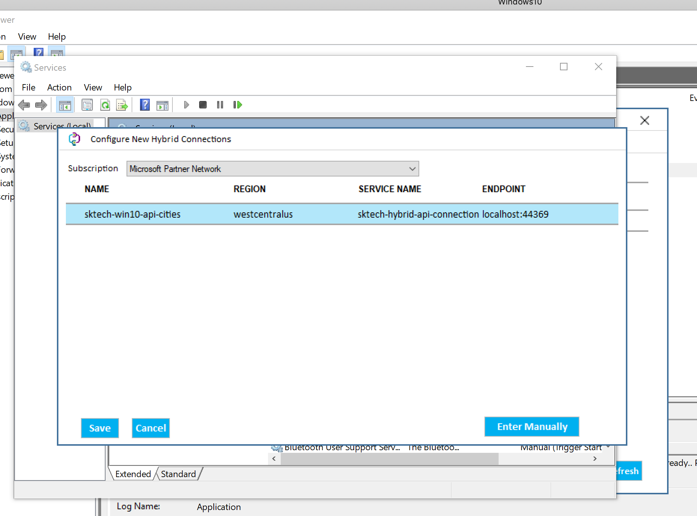
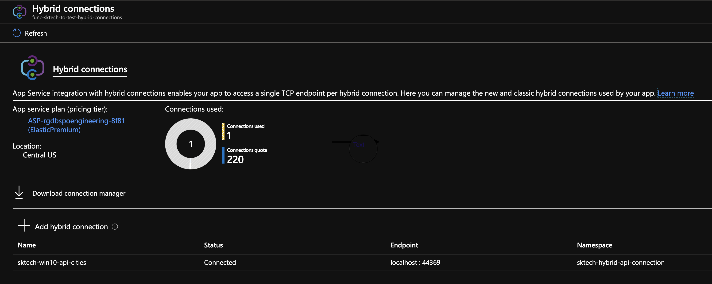
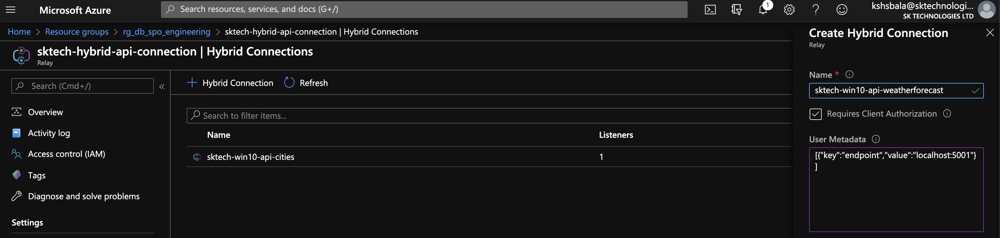
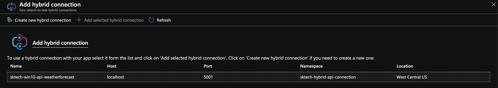
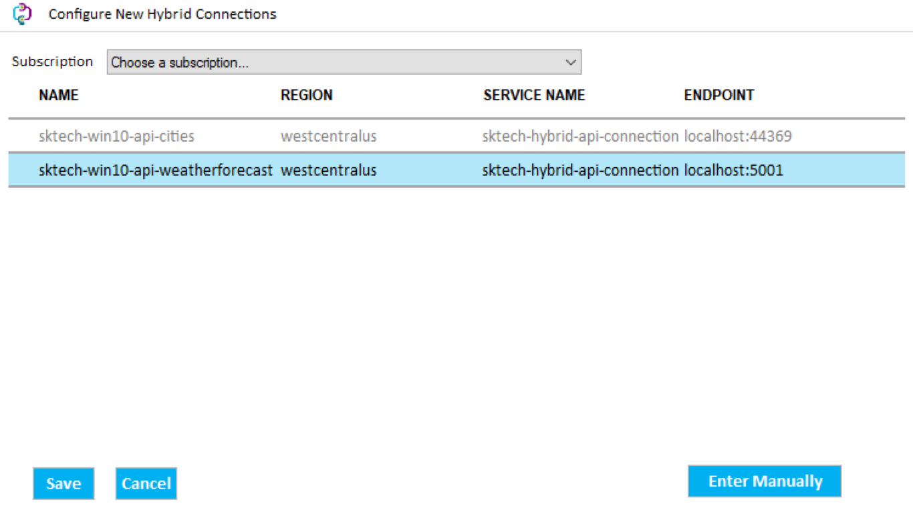
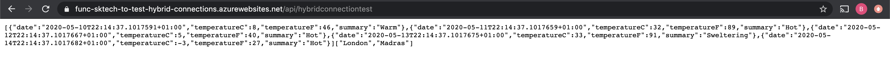

I was looking into some of the options available to connect to the onpremise endpoints from Azure for an O365 solution. Azure Hybrid Connection is one them and here we will see how to set it up to connect to an sample api hosted locally (OnPremise) from the Azure function.

### Azure Hybrid Connection
This uses the Azure Service Bus Relay capability to establish a secure connection between the systems. One of the key benefit of using this is easy to setup and it uses and the connections are all outbound over standard ports. More details of the Hybrid Connection can be found <a href='https://docs.microsoft.com/en-us/azure/app-service/app-service-hybrid-connections'>here</a>.

### Setup
Here we will see some of the key steps to setup the connection between an OnPremise system hosting an api.

#### OnPremise API Setup:
For this scenario, setup the below end points with the self-signed certificates on my local machine as detailed below.

1. https://localhost:44369/api/cities
   
   returns: ["London","Madras"]

2. https://localhost:5001/WeatherForecast
   
   returns:[{"date":"2020-05-10T11:32:37.2718655+01:00","temperatureC":-8,"temperatureF":18,"summary":"Hot"}..]

#### Azure Functions:
Implement a Azure Function to call the above api and return the combined output.

#### Azure Hybrid Connection Manager Setup:
Download the Azure Hybrid Connection Manager from the Hybrid Connections sections panel by clicking the "Download connection Manger".

#### Add a new Hybrid Connection:
Configure a new hybrid connection for the first endpoint -  https://localhost:44369/api/cities .

Once the connection is created, it will be ready to connect to the specified end point as below.

#### Azure Relay:
Adding a new Hybrid connection creates a new Azure relay resource, creates an hybrid connection and gets associated with the Azure Functions.

#### Install and Setup the Azure Hybrid Connection Manager:
Download the Azure Hybrid Connection Manager from the Hybrid Connections sections panel by clicking the "Download connection Manger".

Once the setup is completed, the status will be changed to "Connected".

#### Setup and Configure for the second endpoint:

The second endpoint - https://localhost:5001/weatherforecast can be configured the same by following the above steps or by adding the connection directly to the existing Azure relay.

a. Add a new hybrid connection in the existing relay

b. Add the hybrid connection in the Azure Functions

c. Configure the connection locally on the Hybrid Connection Manager

d. Check the connection status in the Azure function

### Run the function:

Important Notes:

1. TCP Port 9350 - 9354 is open to connect to the ServiceBus from the client.