In the last 3 to 5 years, there has been more emphasis on Collaboration, Lean, Agile, SelfService work model everywhere so that the people can act quickly and respond in a timely manner. Office 365 platform allows any enterprise to adapt to the change quickly by providing rich features / tools (Teams, Bots, PowerAutomate etc) with an ability to build custom features easily. Recently I was looking into a different mechanism to bring the ServiceNow data into the Teams to the end users who can query the ServiceNow details easily within the Teams.

Here we will see how we can quickly create a ServiceNow Bot using the Power Virtual Agent to query the ServiceNow incidents within the Teams by an user.

### Power Virtual Agents (PVA)

PVA is a SaaS which allows Subject Matters Experts to build AI driven BOTS quickly using a graphical interface quickly with an ability to connect to different systems using the PowerAutomate and more details can be found <a href='https://docs.microsoft.com/en-us/power-virtual-agents/fundamentals-what-is-power-virtual-agents'>here</a>

#### Create a New Bot

Login to the <a href='https://powerva.microsoft.com/'>Power Virtual Agent</a> with the M365 account and create a new BOT.

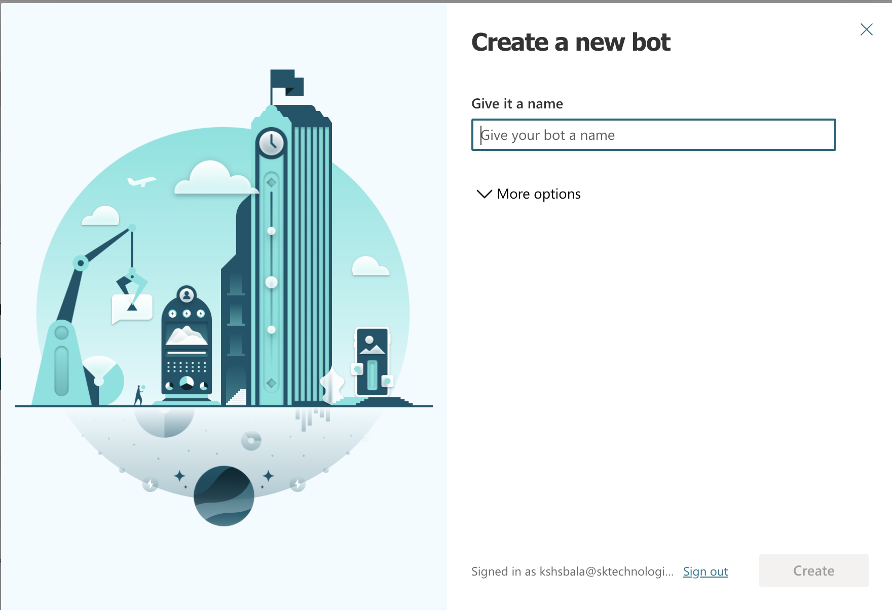

#### Key in the Bot Name

Enter the BOT Name "Service Now", click "Create" and wait for the BOT to be created.

#### Customise the Topic

Once the Bot is created, create a new topic so that the Bot can understand and respond to a list of keywords (Incidents, Tickets).

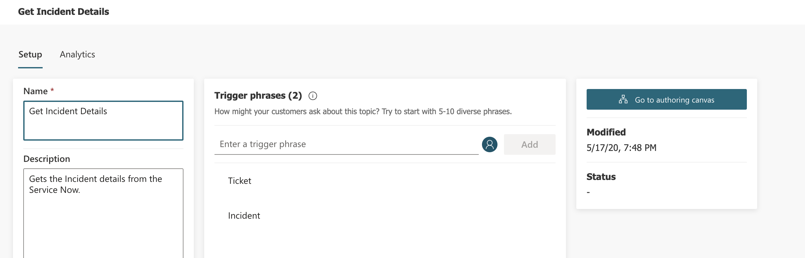

#### Author the Bot

Author the Bot, by clicking the "Go to authoring canvas" and add a question to capture the incident number from the user followed by an action to pass the incident number to a PowerAutomate as below.

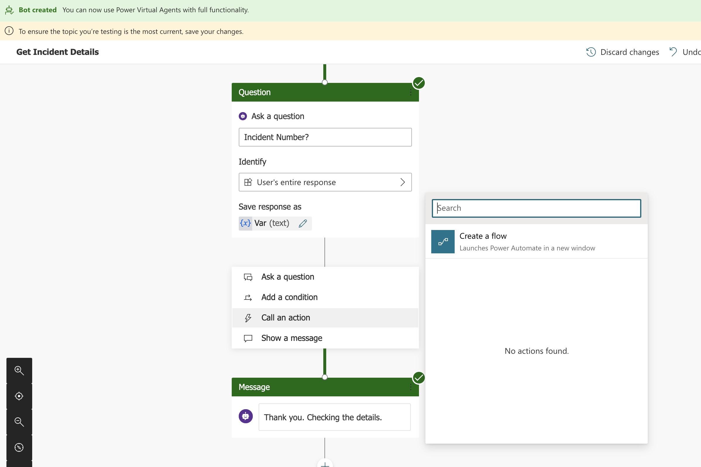

#### Create a new flow to get the Incident details

Create a new flow by clicking "Create a flow". This will launch a PowerAutomate in a separate window with the PVA Flow template.

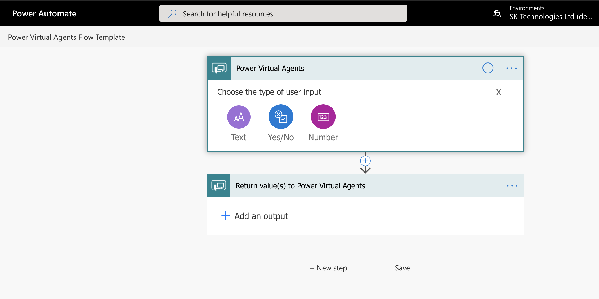

#### Connect to ServiceNow 

Configure the flow to get the details from the ServiceNow to get the incident details as below.

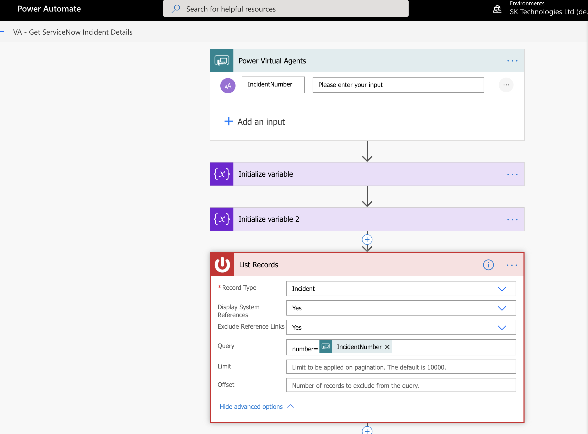

#### Return the Incident details

Return the Incident details (ex: Incident State) from the ServiceNow as an output to PVA.

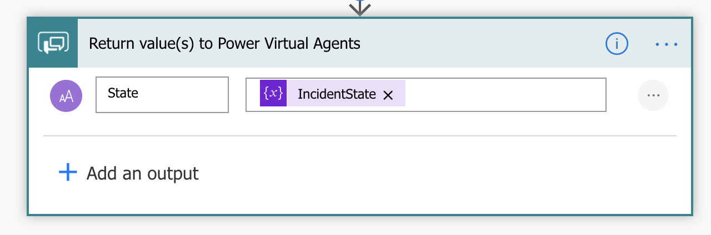

#### Author to display the incident details

Save the data received from the flow as a variable / entity and display it to the user.

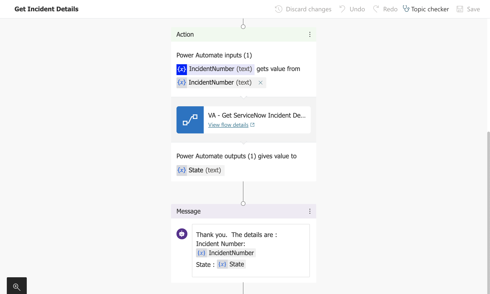

#### Publish the Bot

Once it is configured and tested, publish the Bot.

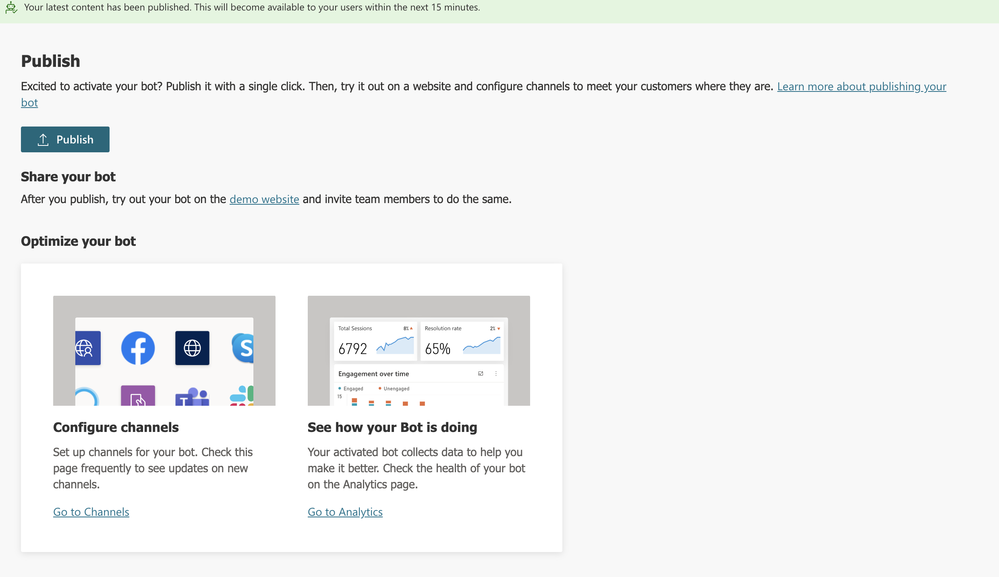

### Teams - Channel Configuration

Configure the Teams channel to use the ServiceNow Bot, Add it to the channel and note down the AppId.

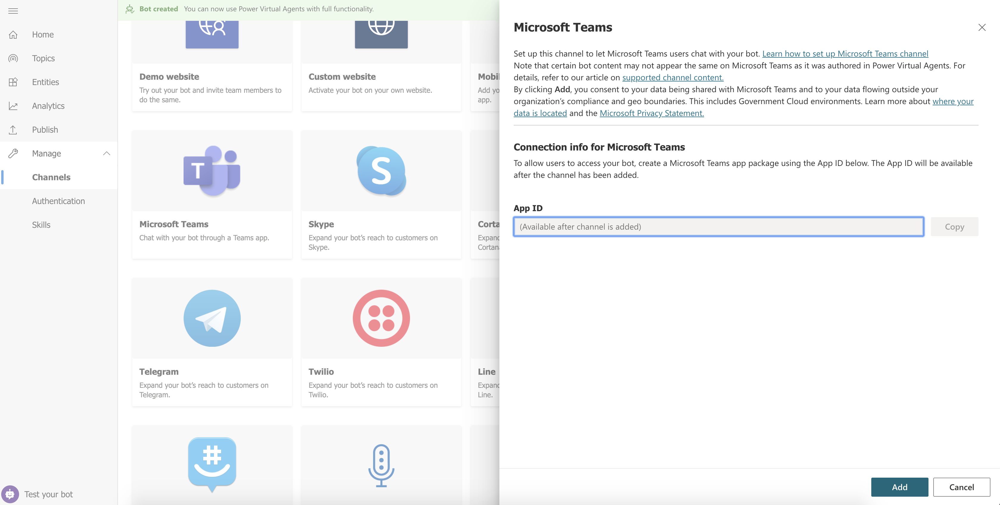

### Teams - Add Bot - App Studio

Create an App in the Teams App Studio as a Bot.

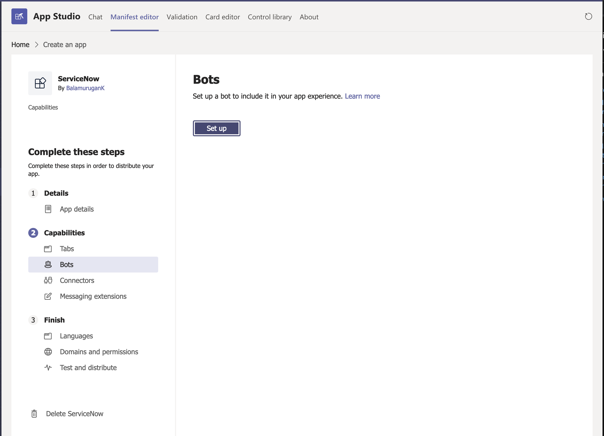

Create an App in the Teams App Studio as a Bot.

Setup as a Bot with the AppId 

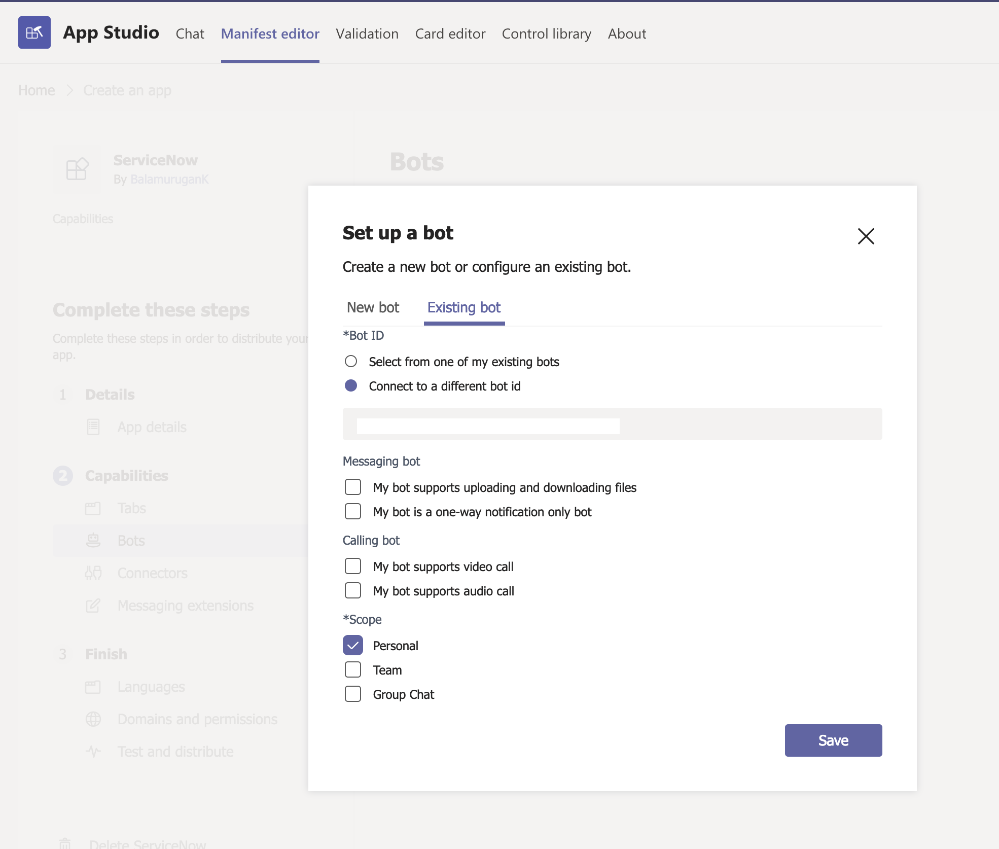

### ServiceNow Bot

Once it is registered it is available within the Teams so that user can get the details of a given incident.

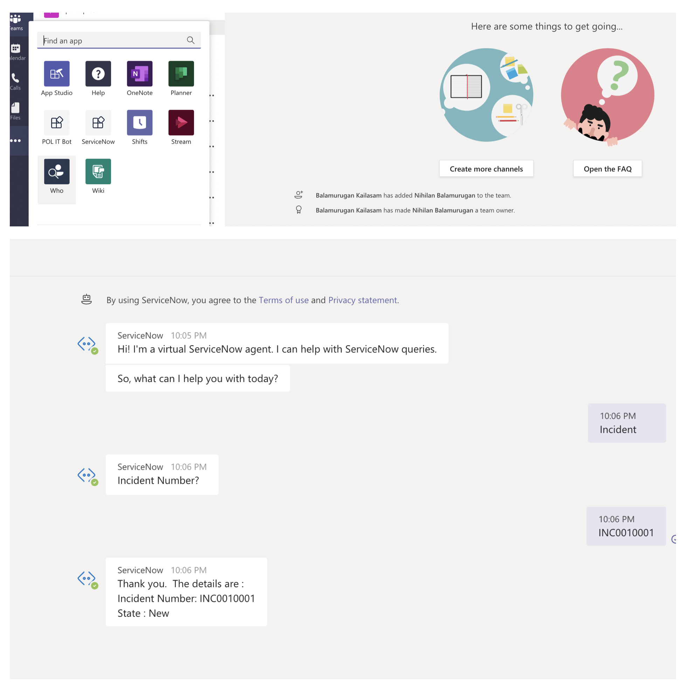

This can be extended to get further details from the ServiceNow.