After the recent announcement about the SharePoint Syntex, I started looking into how to utilise SharePoint Syntex capability for my day to day work to manage all the documents (Statements, Expenses etc), classify and retain it easily as soon as the document is scanned and uploaded using the PowerApp and PowerAutomate.

### SharePoint Syntex Setup

Get the SharePoint Syntex licence for the tenant.

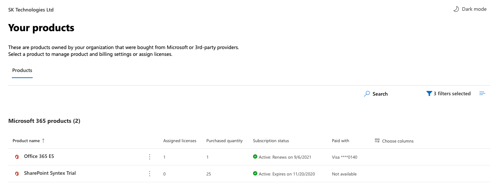

#### Create a Content Centre

Create a new "Content Center" site.

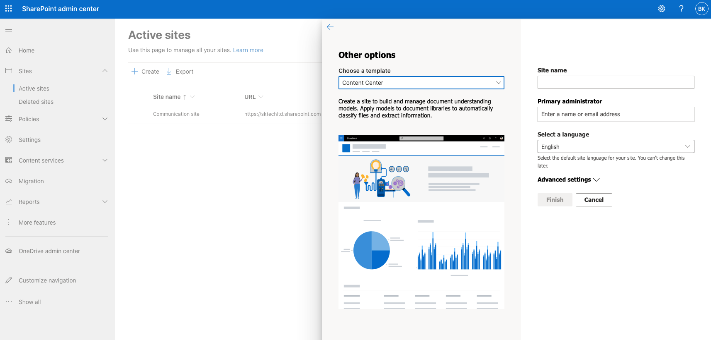

Go to the Content Centre site

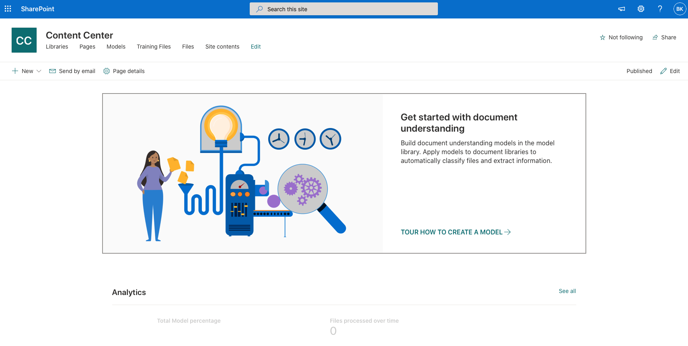

### Create a model

Once the content centre is ready, Create a model 'Expenses' to train some sample content for classification, extraction and apply it to a document library.

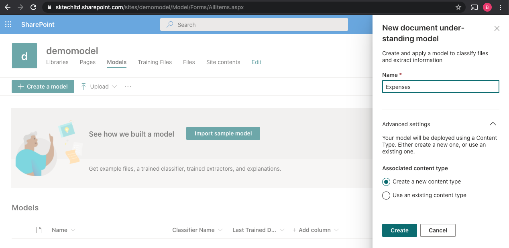

The above creates the model with a new Intelligent Document content type.

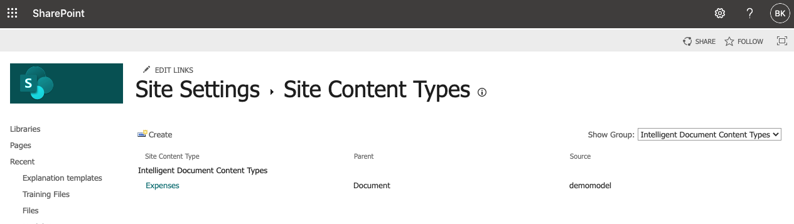

Train, Classify, Extract Metadata and Publish the model to a library.

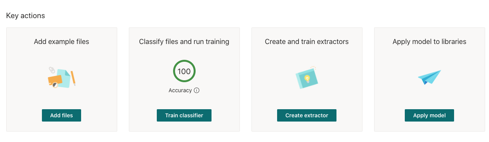

#### Add example files

Upload a list of sample documents to the model.

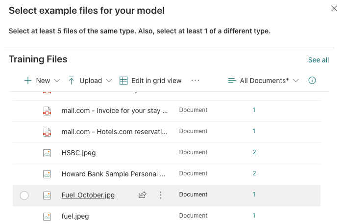

#### Classify files and run training

Classify the uploaded sample files for the type 'Expenses'.

#### Create and Train Extractors

Create an Extractor 'Total' to get the Total amount from the expenses document and Train it with the sample uploaded documents.

The above step will extract the data and store it as a metadata in the document library.

#### Apply model to libraries

Apply the model to a document library by selecting the site and the document library.

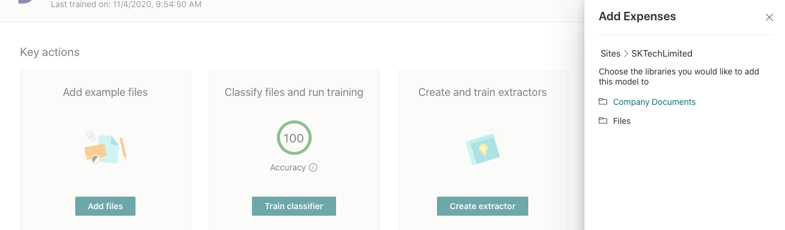

The applied model can be removed from the model dashboard page.

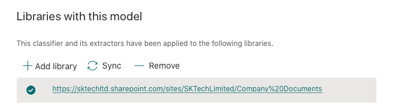

Once the model is applied to the document library, it publishes the 'Expenses' model content type with the additional metadata like 'Classification Date', 'Confidential Score' and along with the 'Total' extracted metadata specified in the model.

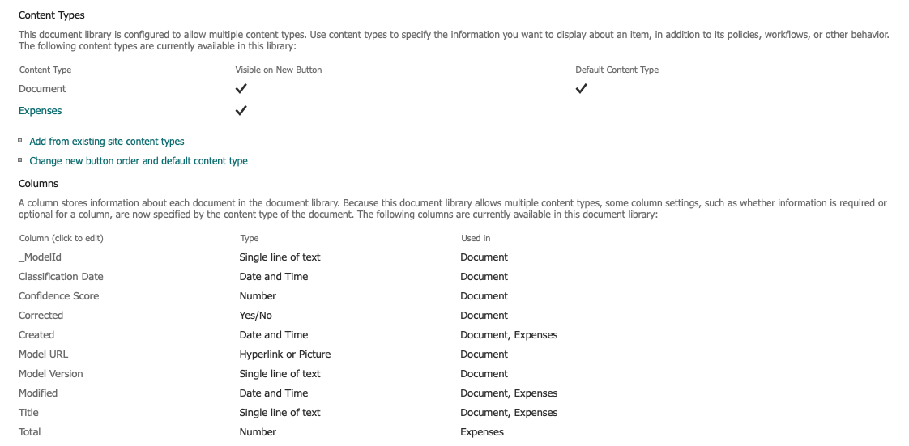

Now we have the model created and applied to a document library ready to classify and extract the data.

### Create a powerapp to scan and upload the document

Create a PowerApp / PowerAutomate (based on <a target='_blank' href='https://www.youtube.com/watch?v=3QaiM8SeWfM'>Shane Young - PowerApp video</a>) to scan and upload the document to the above library.

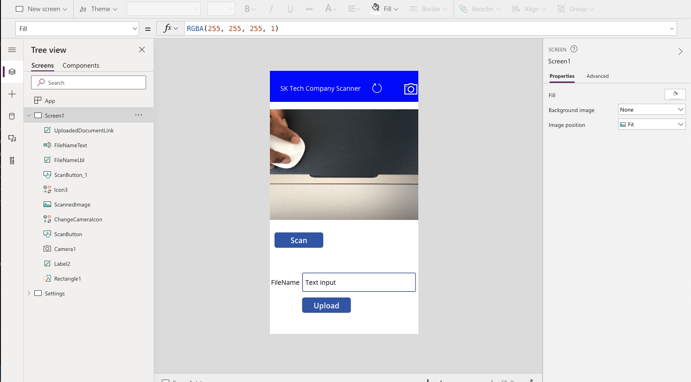

Link the below PowerAutomate to upload to upload the scanned document.

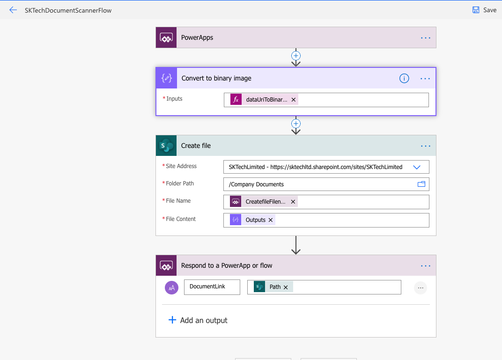

### Scan and Upload the document

Now lets scan the document and upload it to the document library.

#### Scan the document
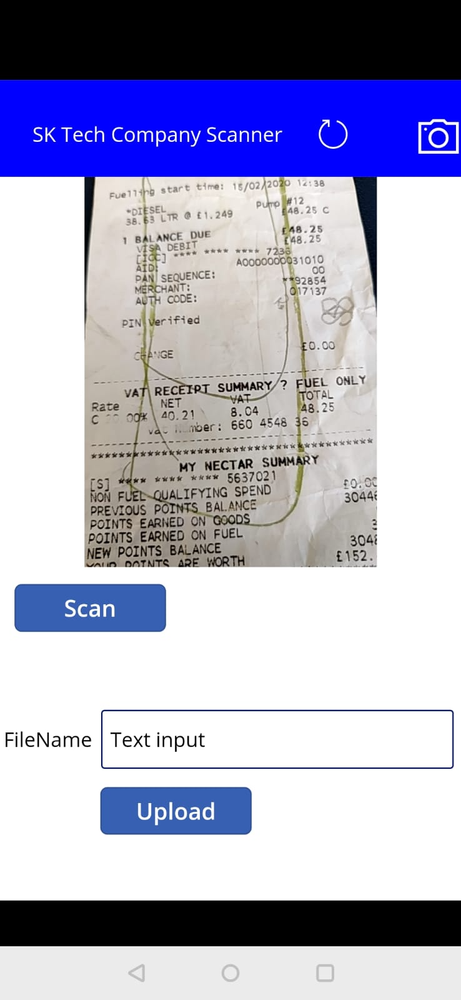

#### Upload the document to the SharePoint library
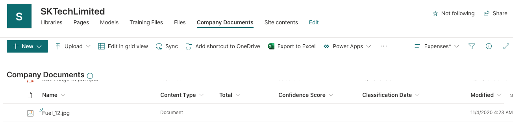

#### Document classified and metadata extracted based on the model configuration

Once the document is uploaded to the document library, the model will scan and extract the metadata accordingly.
In this case, it has automatically extracted the Total amount spend on the expenses and update the 'Total' metadata column and updates the content type as 'Expenses'

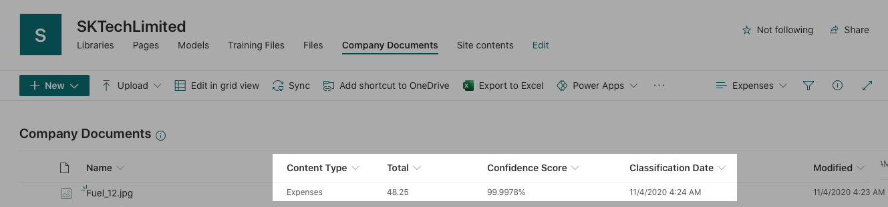

### Retain document based on the Content Type

The above can also be used to apply the retention label to the document based on the model so that the contents can be retained based on the type of document.

#### Set the Retention label on the model

The model can be set to apply label at the time of classification as below.

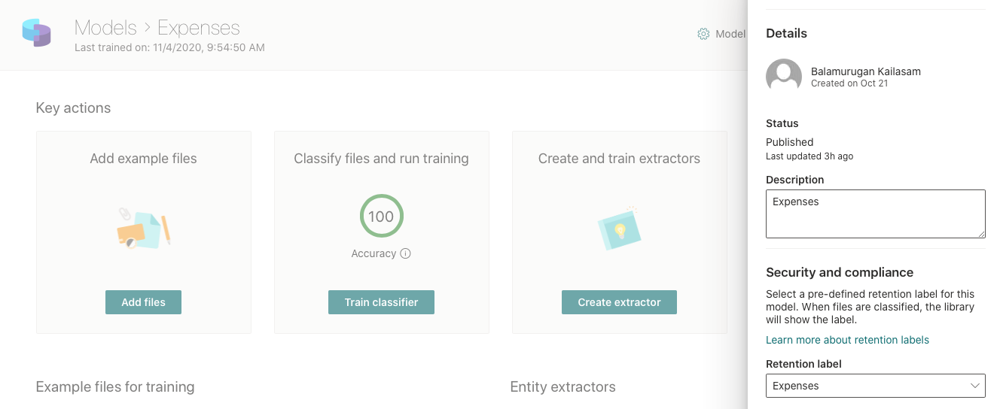

Once it is configured, the retention label is applied at the time of classification.

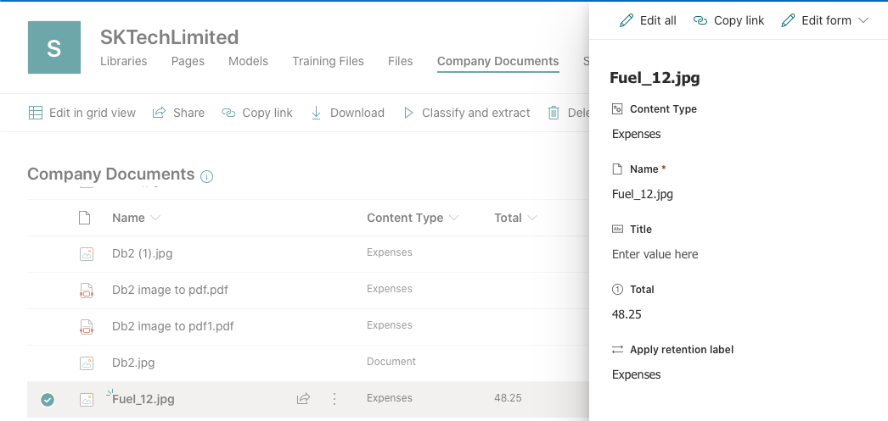
