Here we will see how to use the PowerAutomate to create a new Flow from a template Flow and attach it to a document library using the PowerAutomate. This allows us to maintain the Flow functionality in one place with an ability to create a Flow and attach it to a list or document library for a site. In this example, we will see how a "Request manager approval for a selected file" flow can be attached a site.

### SharePoint Template Site and Document Library

Provision a new site and a document library for the template "Request manager approval for a selected file" flow.

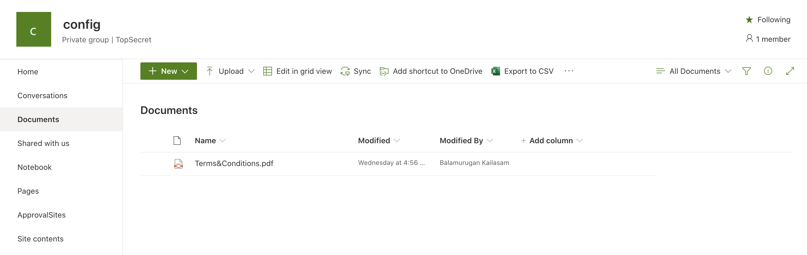

### Create "Request manager approval for a selected file" Flow 

Provision "Request manager approval for a selected file" Flow and attach it to the Document library. This Flow will be used to create a new instance and attached it to a Site.

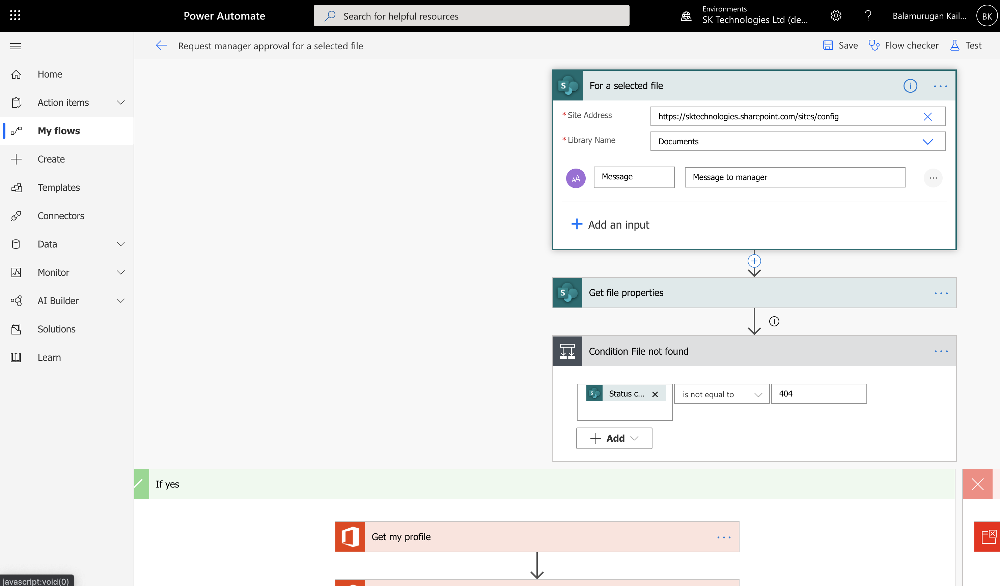

#### Flow Attached to the Document lirary

The flow can be triggered by an user for a selected document.

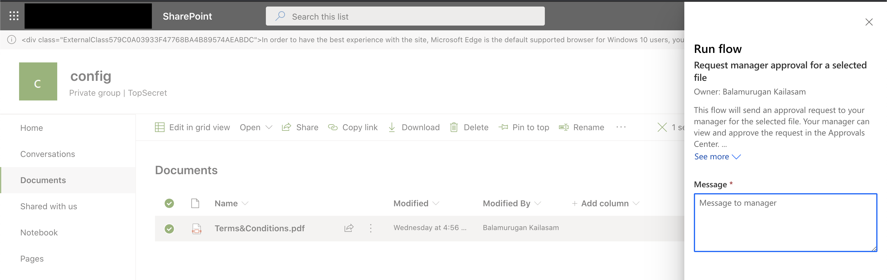

So the Flow is ready now and for this scenario, we will use the above Flow to create a new instance based on this and attach it to a new Site Document library using a Flow.

#### ApprovedSites List

Create a new SharePoint List "ApprovedSites" containing a list of sites which we need to create a new Flow based on the above and attach it to the Document library.

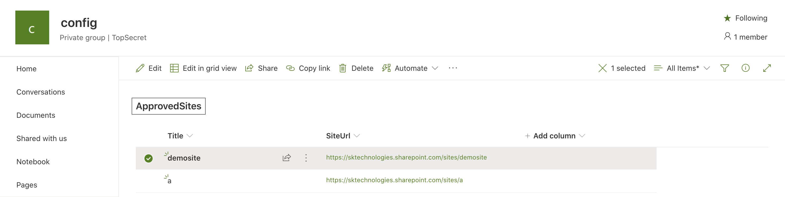

### Create a Flow based on the existing Flow

In this step, we will attach the Flow for the ApprovedSites as below.

#### Set the Trigger

Attach this flow to the "ApprovedSites".

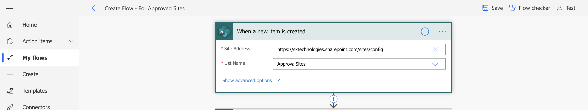

This Flow will be triggered everytime a new Approved Site is created.

#### Initialise the variables

Initialise some variables for FlowDefinition, Connections etc.

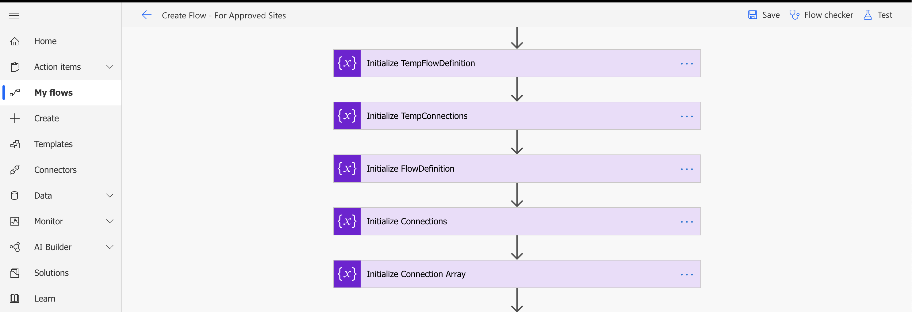

#### Get the "Request manager approval for a selected file" Flow

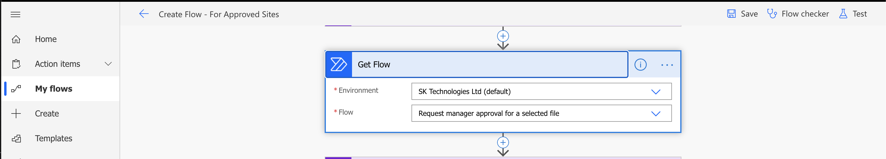

In this step, we will get the Flow Details like "Flow Definition", "Connections" etc. These details will be used to create a new Flow instance.

#### Get the FlowDefinition, ConnectionReferences details from the Templated Flow

Set the variables FlowDefinition, Connections with the details from the "GetFlow" action followed by parsing the connections as a JSON and construction the Connections array. These will be used later to create the flow.

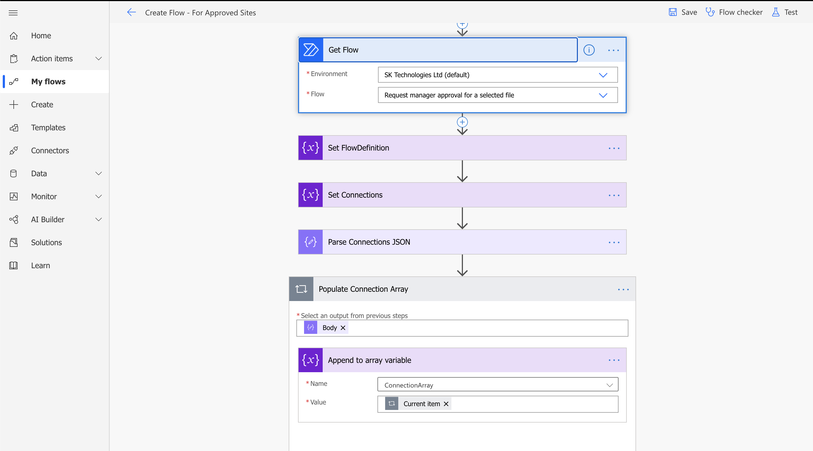

#### Replace the Trigger Url and the Document Library ID in the templated FlowDefinition

The templated Flow contains the Url of the template Site and the Document library. This will be replaced with the ApprovedSite Url and Document Library.

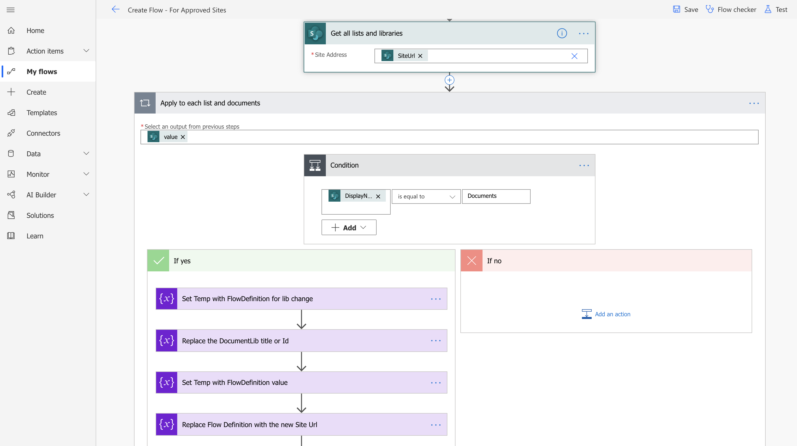

#### Create Flow for the ApprovedSite Document Library

Call "Create Flow" actions with the FlowDefintion and ConnectionReferences.

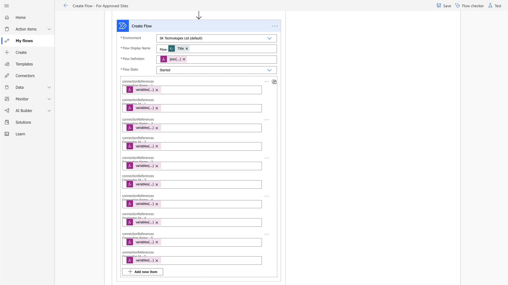

The above sets the FlowDefinition and Connection properties with the updated FlowDefinition (containing the ApprovedSite url and DocumentLibrary Id) and Connection References (using the existing connection).

Note: ConnectionReferencesName is set as - variables('ConnectionArray')?[<<index>>]['connectionName'] and ConnectionReferencesId is set as - variables('ConnectionArray')?[<<index>>]['id'].

### ApprovedSite Flow

Once site is registed in the ApprovedSite, "Create Flow - For Approved Sites" Flow gets executed and creates a Flow on the ApprovedSite based on the templated Flow.

#### Regiser a Site in the "ApprovedSites" List

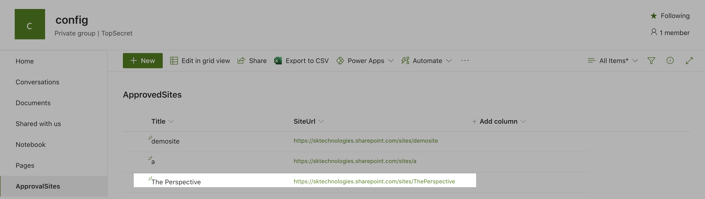

#### The configured flow creates a new Flow instance for the ApprovedSite

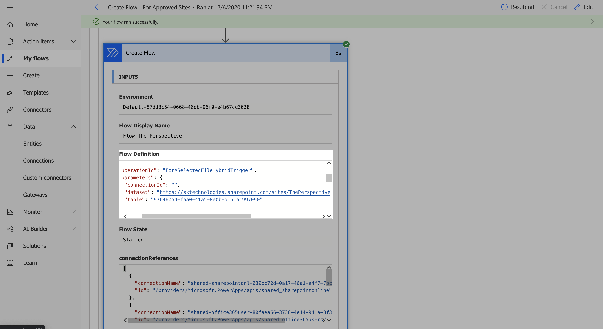

#### The new Flow is attached to the ApprovedSite's Document Library

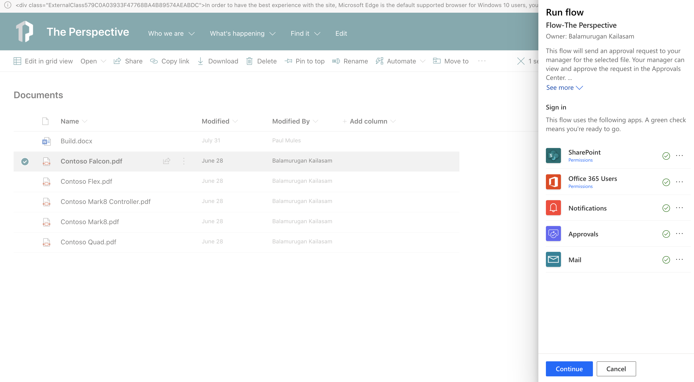

Note: The above creates a Flow for a Document Library using the existing connection references and more details on the limits of the PowerAutomate (ex: Number of Flows owned by a single user etc.) and the work around can be found <a href='https://docs.microsoft.com/en-us/power-automate/limits-and-config' target='_blank'>here</a>.