Here we will see how to Create, Configure and Consume the Custom Connector to query a M365 group members as a paged result using the M365 Graph api.

### Register an Application with a Delegated Group.Read.All permission

First, Register an application for the PowerPlatform Custom connector with the Delegated permission to read the groups.

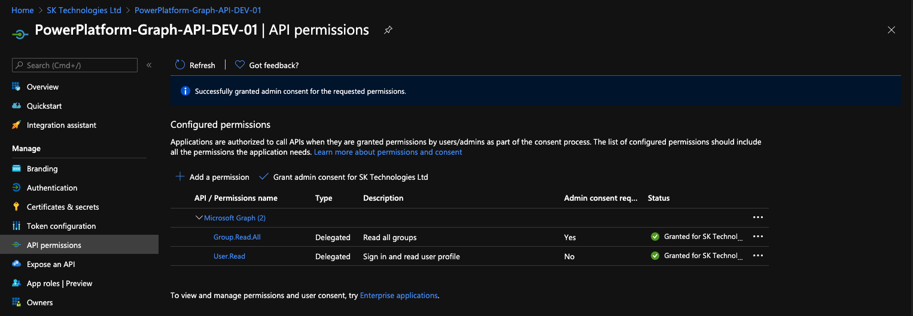

### Create a Custom Connector

Create a new custom connector as below with the host as 'graph.microsoft.com'

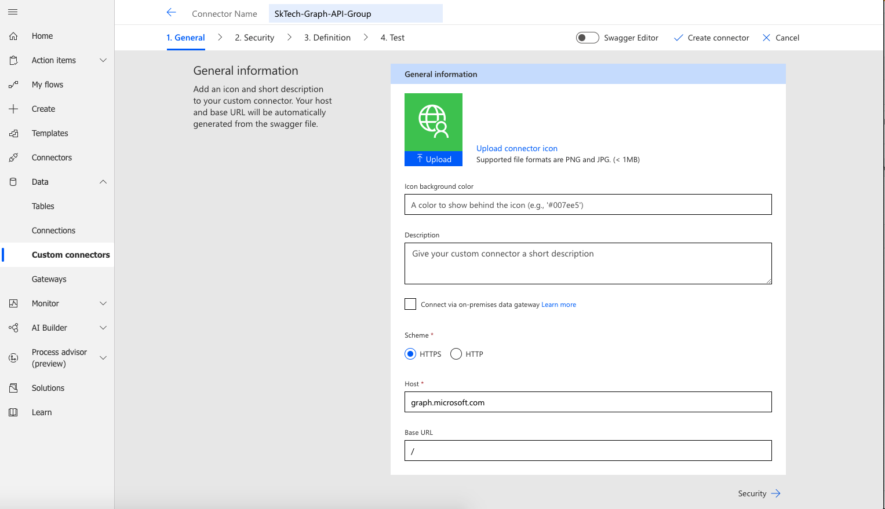

#### Set the Authentication type

In the Security tab, set the authentication type as below using the details from the registered app.

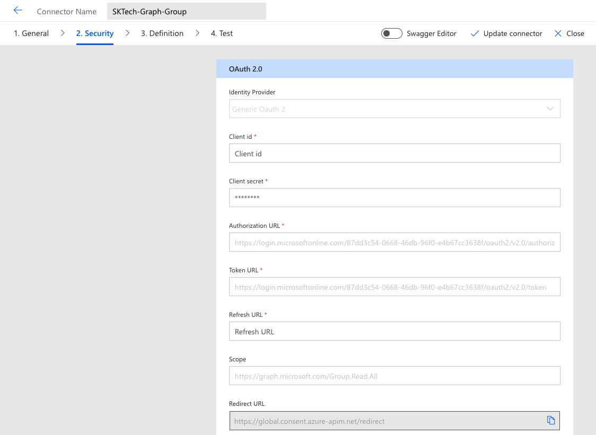

#### Update the app with the Custom Connector redirect url

Once the connector is updated, update the app with the redirect url.

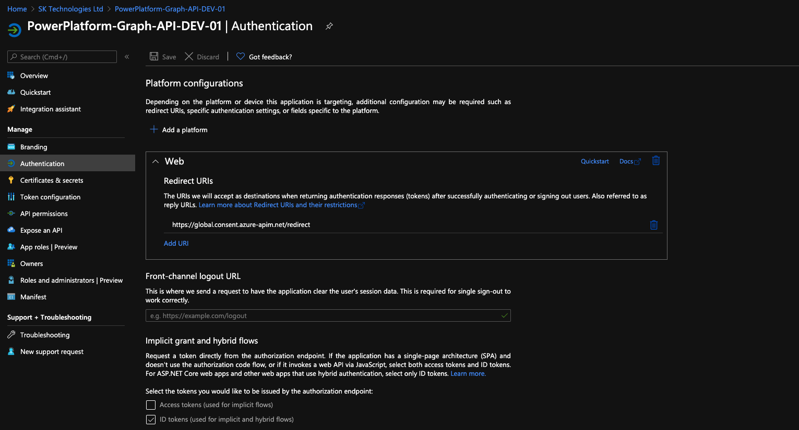

### Create a Definition to get the group members

Create an action to get the list of group members as below.

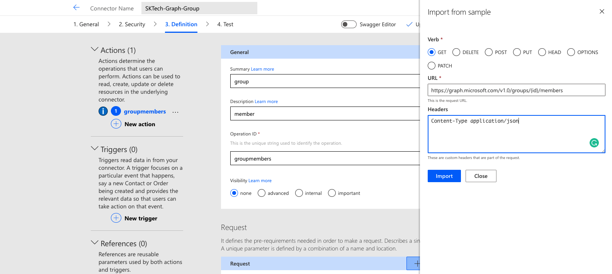

#### Test the action

Test the configured "getgroupmembers" action.

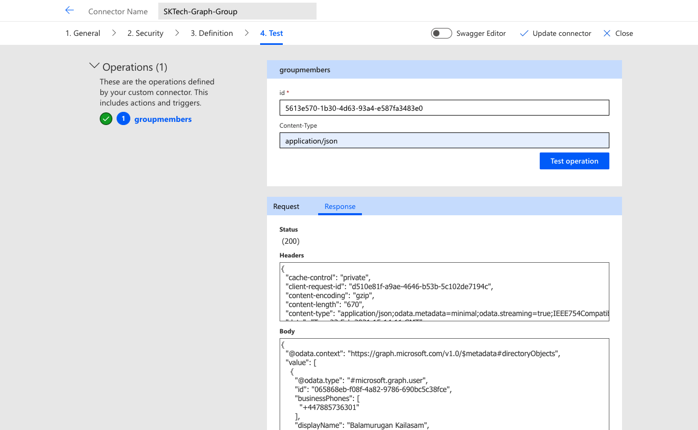

### Amend the action using the Swagger editor to accept the query parameters

Amend the definition to include the additional query parameters required for the graph api to return the list of members for the specified page as below.

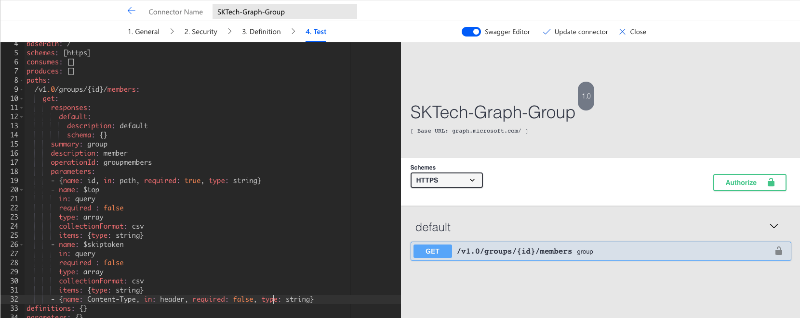

Sample swagger json:

#### Test the action with the query parameters

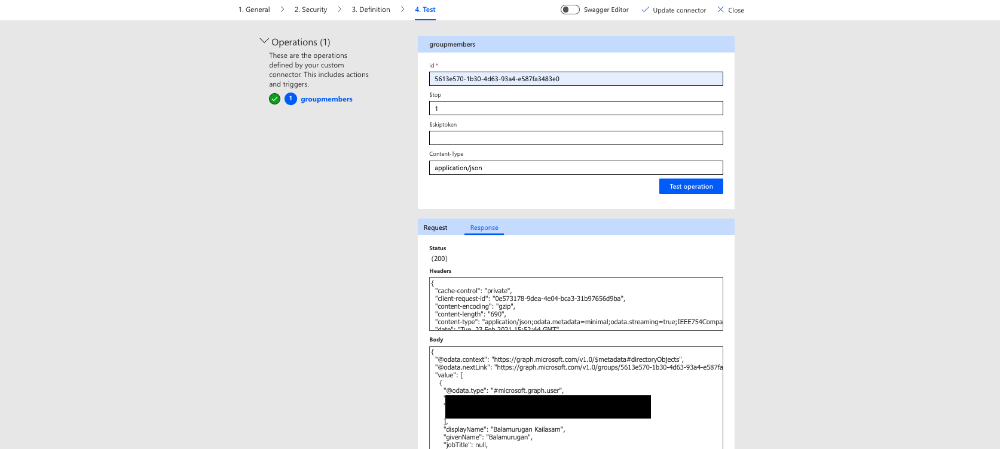

### Create a PowerAutomate

We will create a PowerAutomate to read all the group members in pages and call the same action again with the right token to query members of a group.

#### Add the custom connector action

Include the custom connection action to get group members one at a time as below.

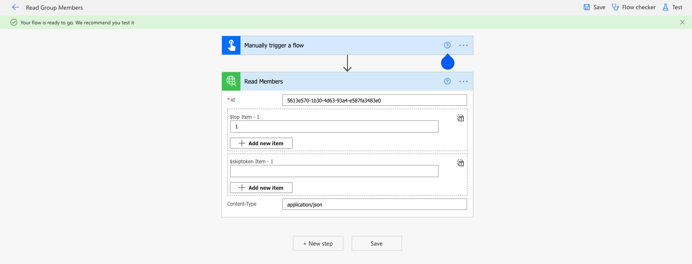

#### Check for the response and call the same action again with the additional parameters

Get the response and check for the @odata.nextLink in the response.

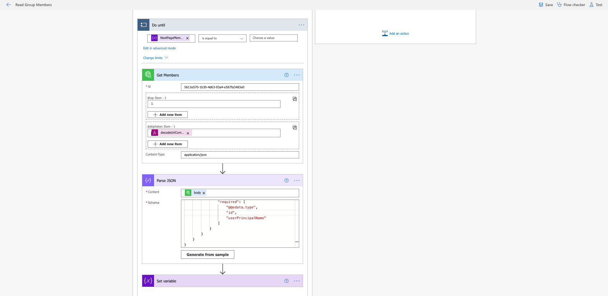

#### Call the same action again by passing the token received from the previous response

Get all the members until the last page of members is received.

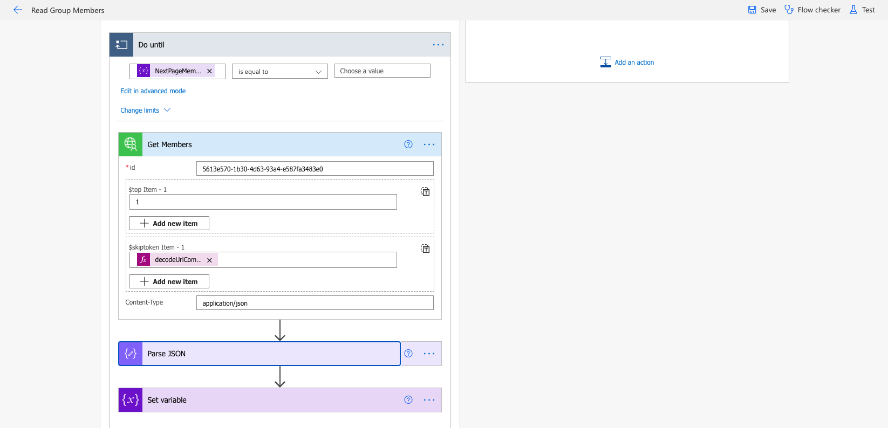

### PowerAutomate Result

<a href="../images/posts/8/PowerPlatform-CustomConnector-Result.mov" title="PowerAutomate Custom Connector" target="_blank">
  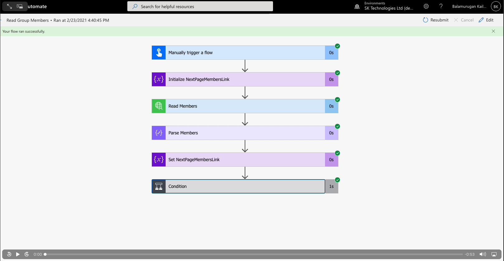
</a>

